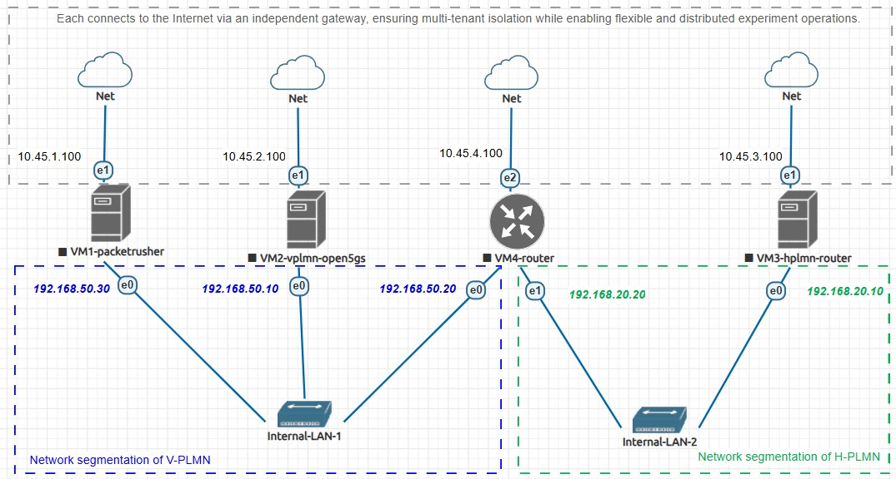

# R-5GS: A Full-Scale 5G Roaming Testbed on EVE-NG

This repository provides the reproducible implementation of **R-5GS**, a full-scale, multi-operator 5G roaming testbed based on **Open5GS** and **PacketRusher**. The testbed is designed to go beyond core-level simulation by enabling realistic, end-to-end roaming evaluation across UE, RAN, and Core Network layers. This platform serves both research and education purposes in mobile networking, security, and inter-PLMN interoperability.

## [1] Motivation

While roaming is a pivotal element in 5G system architecture, current open-source platforms fall short in fully supporting cross-PLMN evaluation. In particular:

- **Open5GS** provides only partial roaming support.
- **UERANSIM** and **OpenAirInterface** lack proper roaming-capable UE/RAN simulation.
- Most existing setups simulate only core-level roaming.

R-5GS bridges this gap by offering a full-stack roaming environment—including **UE registration, PDU session establishment, and inter-PLMN SBA signaling via N32**.


## [2] Architecture Overview

The R-5GS testbed consists of:

| VM | Role | Description |
|----|------|-------------|
| VM1 | UE/RAN | PacketRusher-based UE/gNB simulator |
| VM2 | V-PLMN | Open5GS (AMF, SMF, UPF, SEPP, etc.) |
| VM3 | H-PLMN | Open5GS (AMF, SMF, UPF, SEPP, etc.) |
| VM4 | IPX | Simulated IPX router with iproute2 |

Each VM is assigned a dedicated NAT gateway (`pnet1`–`pnet4`) to ensure isolation between different vendors.

Each PLMN is assigned a network segmentaiton(`Internal-LAN-1`-`Internal-LAN-2`) to forward 5G roaming traffic. 




## [3] Deployment Options

We provide **two deployment methods** to suit different needs:

### [3-1] Requirements for Option 1

- VMware Workstation 17 Pro - v17.5.0 

### [3-2] Option 1: Quick Deployment (Prebuilt EVE-NG VM Export)

If you want to run the testbed immediately without rebuilding everything:

1. Download our prebuilt EVE-NG VM [[R-5GS.zip]](https://drive.google.com/file/d/1wKQYs--OQn9XEg68P6qQnO_OdGcTWo4R/view?usp=sharing).
2. Extract zip file and import the `R-5GS.ovf` into VMware Workstation.
3. Boot the `R-5GS` VM and log in.
4. Configure the IP address used by EVE-NG to provide services via the command below.

    ```bash
    ### lookup the network interface used by the NAT mode of VMware on your windows host(usually VMnet8)
    ipconfig

    ### config the eve-ng to that subnet
    ### edit the 'pnet0' network configuration and reboot
    sudo nano /etc/network/interfaces
    sudo reboot
    ```
5. Access EVE-NG via browser using `http://192.168.x.x` and execute R-5GS lab.
6. Boot `linux-vm1-packetrusher` and execute the command below.

    ```bash
    ### initialize routing setup
    cd Desktop
    sudo bash routing_setup.sh
    ```
7. Boot `linux-vm2-vplmn-open5gs` and execute the command below.

    ```bash
    ### initialize routing setup
    cd Desktop
    sudo bash routing_setup.sh

    ### run VPLMN 5G core
    sudo bash run_vplmn.sh
    ```
8. Boot `linux-vm3-hplmn-open5gs` and execute the command below.

    ```bash
    ### initialize routing setup
    cd Desktop
    sudo bash routing_setup.sh
    
    ### run HPLMN 5G core
    sudo bash run_hplmn.sh
    ```
9. Boot `linux-vm4-router` and execute the command below.

    ```bash
    ### initialize routing setup
    cd Desktop
    sudo bash routing_setup.sh
    ```
10. Test validity via ue registration and PDU session establishment on `linux-vm1-packetrusher`.

    ```bash
    ### initiate ue registration and PDU session
    cd PacketRusher
    sudo ./packetrusher ue
    ```

-------

### [3-3] Requirements for Option 2

- VMware Workstation 17 Pro - v17.5.0

- EVE-NG Community Edition - v6.2.0-4

### [3-4] Option 2: Manual Deployment (Educational & Reproducible)

If you'd like to **learn how to build the testbed from scratch** on your own EVE-NG installation:

1. Download our prebuilt topology document [[R-5GS.unl]](R-5GS.unl) and linux image [[linux-vm1-packetrusher]](https://drive.google.com/file/d/1vXR4MzqyJY_razetuwOhh9oUU38Sulz0/view?usp=sharing), [[linux-vm2-vplmn-open5gs]](https://drive.google.com/file/d/10lP_UaRAthMw_ExxIl1Og6qMD98oD-dF/view?usp=sharing), [[linux-vm3-hplmn-open5gs]](https://drive.google.com/file/d/1oF4sglrRK_iwkYKtBLmQCvMwDvTHtboG/view?usp=sharing), [[linux-vm4-router]](https://drive.google.com/file/d/1qx3zVZaPLwJT1rJLSbm3i7nVyqPbIIJR/view?usp=drive_link).
2. If you're not yet installed EVE-NG, please refer to https://www.eve-ng.net/index.php/documentation/community-cookbook/ and install it.
3. Boot your installed EVE-NG VM and log in.
4. Configure the IP address used by EVE-NG to provide services via the command below.

    ```bash
    ### lookup the network interface used by the NAT mode of VMware on your windows host(usually VMnet8)
    ipconfig

    ### config the eve-ng to that subnet
    ### edit the 'pnet0' network configuration and reboot
    sudo nano /etc/network/interfaces
    sudo reboot
    ```

5. Configure EVE-NG network interfaces to provide four separate NAT gateways for VM1 to VM4.

    ```bash
    ### Config `pnet1~4` on your EVE-NG host via the command below
    sudo nano /etc/network/interfaces
    
    ### Config as belw
    # Cloud devices
    # iface eth1 inet manual
    # auto pnet1
    # - iface pnet1 inet manual
    # + iface pnet1 inet static
    #    bridge_ports eth1
    #    bridge_stp off
    # +  address 10.45.1.1
    # +  netmask 255.255.255.0
    #
    # iface eth2 inet manual
    # auto pnet2
    # - iface pnet2 inet manual
    # + iface pnet2 inet static
    #    bridge_ports eth2
    #    bridge_stp off
    # +  address 10.45.2.1
    # +  netmask 255.255.255.0
    #
    # iface eth3 inet manual
    # auto pnet3
    # - iface pnet3 inet manual
    # + iface pnet3 inet static
    #    bridge_ports eth3
    #    bridge_stp off
    # +  address 10.45.3.1
    # +  netmask 255.255.255.0
    #
    # iface eth4 inet manual
    # auto pnet4
    # - iface pnet4 inet manual
    # + iface pnet4 inet static
    #    bridge_ports eth4
    #    bridge_stp off
    # +  address 10.45.4.1
    # +  netmask 255.255.255.0`


    ### Enable ipv4 forwarding
    sudo nano /etc/sysctl.conf
    
    ### Uncomment the option below
    # - #net.ipv4.ip_forward=1
    # + net.ipv4.ip_forward=1

    ### Config outbound iptable rules for 4 seperate NAT gateway via eve-ng host
    sudo iptables -t nat -A POSTROUTING -s 10.45.0.0/16 -o pnet0 -j MASQUERADE

    ### make the iptable configuration persistent
    sudo apt update
    sudo apt install iptables-persistent
    sudo netfilter-persistent save

    ### reboot to make configuration work
    sudo reboot

    ### check validity
    ip addr show
    iptables -L -nv -t nat
    ```

6. Transfer the `linux-vm1-packerrusher.tar.gz` , `linux-vm2-vplmn-open5gs.tar.gz`, `linux-vm3-hplmn-open5gs.tar.gz` and `linux-vm4-router` to path `/opt/unetlab/addons/qemu` via SFTP.

7. Uzip image file and fix permission.

    ```bash
    ### unzip image file
    cd /opt/unetlab/addons/qemu
    tar -xvzf linux-vm1-packetrusher.tar.gz
    sudo rm -r linux-vm1-packetrusher.tar.gz
    tar -xvzf linux-vm2-vplmn-open5gs.tar.gz
    sudo rm -r linux-vm2-vplmn-open5gs.tar.gz
    tar -xvzf linux-vm3-hplmn-open5gs.tar.gz
    sudo rm -r linux-vm3-hplmn-open5gs.tar.gz
    tar -xvzf linux-vm4-router.tar.gz
    sudo rm -r linux-vm4-router.tar.gz

    ### fix permissions
    /opt/unetlab/wrappers/unl_wrapper -a fixpermissions
    ```

8. Access EVE-NG via browser using `http://192.168.x.x` and import `R-5GS.unl` as a new lab.

9. Boot `linux-vm1-packetrusher` and execute the command below.

    ```bash
    ### initialize routing setup
    cd Desktop
    sudo bash routing_setup.sh
    ```
10. Boot `linux-vm2-vplmn-open5gs` and execute the command below.

    ```bash
    ### initialize routing setup
    cd Desktop
    sudo bash routing_setup.sh

    ### run VPLMN 5G core
    sudo bash run_vplmn.sh
    ```
11. Boot `linux-vm3-hplmn-open5gs` and execute the command below.

    ```bash
    ### initialize routing setup
    cd Desktop
    sudo bash routing_setup.sh
    
    ### run HPLMN 5G core
    sudo bash run_hplmn.sh
    ```
12. Boot `linux-vm4-router` and execute the command below.

    ```bash
    ### initialize routing setup
    cd Desktop
    sudo bash routing_setup.sh
    ```
13. Test validity via ue registration and PDU session establishment on `linux-vm1-packetrusher`.

    ```bash
    ### initiate ue registration and PDU session
    cd PacketRusher
    sudo ./packetrusher ue
    ```


## [4] Login Credential of each vm

| VM | username | password |
|:----|:------:|:-------------:|
| EVE-NG Host | root | eve |
| EVE-NG Web APP | admin | eve |
| linux-vm1-packetrusher | user | user |
| linux-vm2-vplmn-open5gs | user | user |
| linux-vm3-hplmn-open5gs | user | user |
| linux-vm4-router | user | user |

## [5] References
> 1. https://github.com/HewlettPackard/PacketRusher
> 2. https://github.com/open5gs/open5gs
> 3. https://www.eve-ng.net/

## [6] FAQ
#### Q1: How to fix `Intel vt-x/EPT cannot be activated` error when booting EVE-NG?
#### A1: Follow the instruction below

    ```bash
    ### Go to windows feature and de-check Hyper-V
    ### Launch powershell as admin and execute commands blew
    bcdedit /set hypervisorlaunchtype off
    Disable-WindowsOptionalFeature -Online -FeatureName Microsoft-Hyper-V-All
    ### Reboot your windows host and try again
    ```

